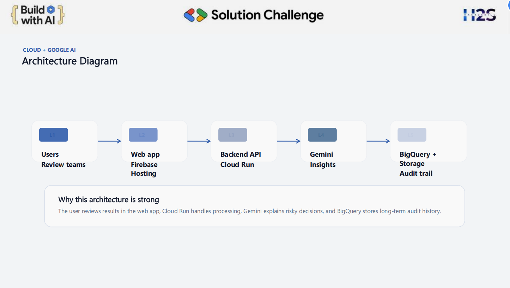
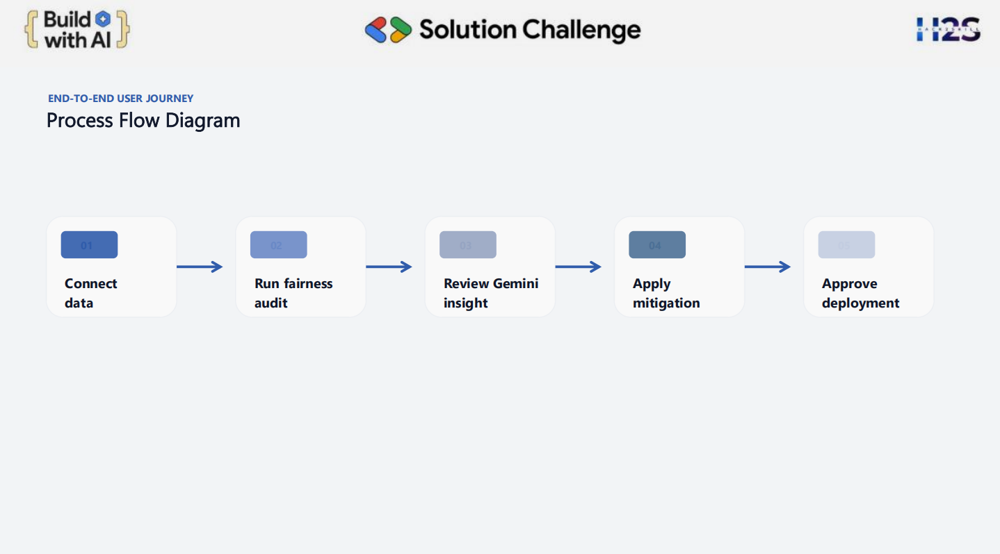
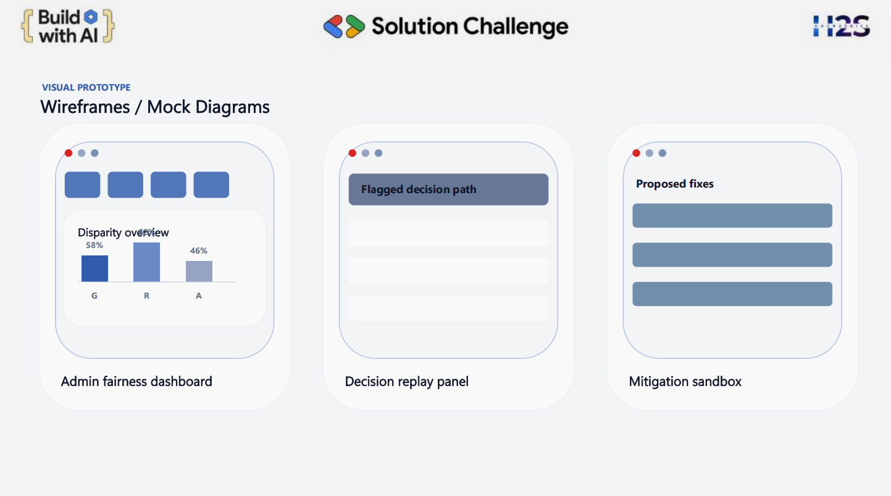
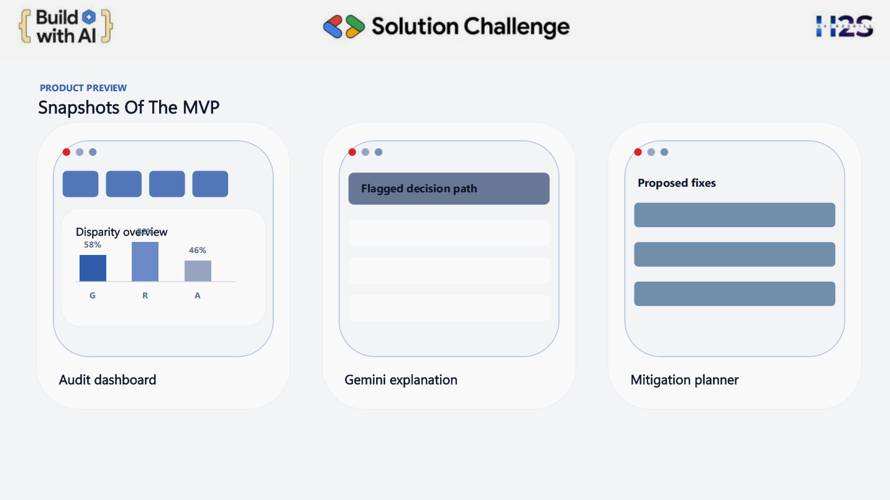

# 🚀 FairLens AI
🏆 Built for Responsible AI & Fairness Auditing

AI Fairness • Responsible AI • Bias Detection

AI-powered fairness auditing platform to detect and mitigate bias in decision-making systems.

---

## 🎯 Key Highlights

- 🚀 Built an AI fairness auditing platform  
- 📊 Implements Demographic Parity & Equal Opportunity  
- 🌐 Deployed live with interactive dashboard  
- 📄 Includes full project documentation  

---

## 🎥 Demo Video

[Watch Demo Video](https://drive.google.com/file/d/1WzmRcHT3WN2GQS69DkW_YuUjTL90YrnS/view?usp=sharing)

---

## ❗ Problem

Modern AI systems influence critical decisions such as hiring, lending, and healthcare.  
However, models trained on biased historical data can unintentionally discriminate.

This leads to:
- Unfair hiring decisions  
- Biased loan approvals  
- Ethical and legal risks  

Organizations currently lack accessible tools to audit and fix such bias effectively.

---

## 🎯 Objective

To build an accessible system that:
- Detects hidden bias in datasets and ML models  
- Provides fairness metrics  
- Helps mitigate discrimination before deployment  

---

## 💡 Solution

FairLens AI analyzes datasets and model outputs to identify bias using fairness metrics and visual insights.

It enables:
- Bias detection  
- Fairness scoring  
- Actionable recommendations  

---

## ✨ Features

- 📊 Bias detection in datasets  
- ⚖️ Fairness metrics evaluation  
- 📈 Visual reports and insights  
- 🌐 Easy-to-use web interface  

---

## Tech Stack

### Frontend
- HTML5
- CSS3
- JavaScript
- Vercel (deployment)

### Backend
- Node.js
- Express.js
- Prisma ORM
- Upstash Redis
- Zod
- JWT Authentication
- bcrypt

### Database / Storage
- Prisma-supported database
- Redis cache (Upstash)

### AI / Cloud (project architecture)
- Google Gemini
- Firebase Hosting
- Cloud Run
- BigQuery
- Cloud Storage

---

## ⚙️ How It Works

1. User uploads dataset or inputs data  
2. System analyzes features and predictions  
3. Fairness metrics are calculated  
4. Bias is flagged and visualized  
5. Suggestions are provided  

---

## 🧩 System Architecture

---

## ⚖️ Fairness Metrics Used

- Demographic Parity  
- Equal Opportunity  
- Disparate Impact  

---

## 📊 Results & Impact

- Identified bias in decision outcomes across protected attributes  
- Applied fairness metrics to evaluate model decisions  
- Built an interactive dashboard for bias visualization  
- Improved transparency in automated decision-making systems  

---

## 🧠 Model & Approach

- Data preprocessing using Pandas  
- Bias detection using statistical fairness metrics  
- Model evaluation across demographic groups  
- Visualization using dashboards and charts  

---

## 🌍 Real-World Impact

FairLens AI helps organizations:
- Reduce bias in hiring systems  
- Ensure fairness in financial decisions  
- Build ethical AI systems  
- Comply with responsible AI guidelines  

---

## 🚀 Why FairLens AI?

- Simple interface for non-technical users  
- Combines fairness metrics with visual insights  
- Designed for real-world deployment scenarios  

---

## 🌐 Live Demo

👉 https://fairlens-ai.vercel.app  

---

## 📸 Screenshots

### 🔹 Preview

### 🔹 Dashboard

### 🔹 Workflow

### 🔹 Architecture

---

## 📄 Documentation

[View Full Project PDF](./docs/FairLensPrototype.pdf)

---

## 🚀 Future Scope

- Real-time model auditing  
- API integration for enterprise use  
- Advanced bias mitigation techniques  
- Scalable dashboard for organizations  

---

## 👤 Author

Archita Guha Roy  

---
